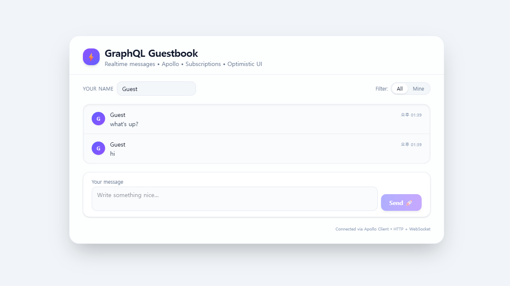
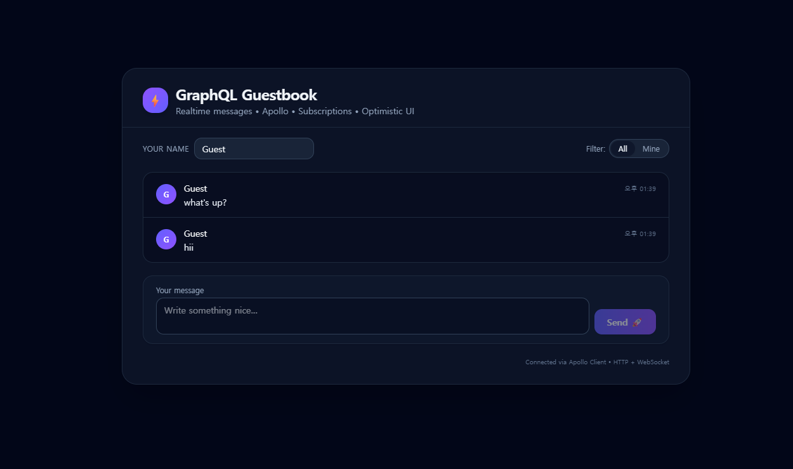

# 🪶 GraphQL Guestbook (Realtime) — 한국어

[🇬🇧 English README](./README.md) • [🇺🇿 O‘zbekcha README](./README.uz.md)

**최소 기능의 풀스택 GraphQL 프로젝트**  
**Apollo Server / Apollo Client / React / Vite / Tailwind CSS** 기반으로,  
**Query · Mutation · Subscription(실시간)** 및 **Optimistic UI**를 제공합니다.

> 💬 메시지를 보내면 다른 탭에서 실시간으로 나타나는 것을 확인하세요!

---

## 🖼 프로젝트 배너


---

## 🌐 데모

[🔗 라이브 데모 (Vercel)](https://graphql-guestbook-realtime.vercel.app)  
[⚙️ 백엔드 API (Render)](https://graphql-guestbook-realtime.onrender.com/graphql)

---

## 🧱 기술 스택

| 레이어       | 기술                                                        |
| ------------ | ----------------------------------------------------------- |
| **Frontend** | React + Vite + Apollo Client                                |
| **UI**       | Tailwind CSS · 반응형 · 글래스모피즘 디자인 · 자동 다크모드 |
| **Backend**  | Apollo Server + Express + GraphQL Subscriptions             |
| **Realtime** | graphql-ws + WebSocket                                      |
| **언어**     | JavaScript (ES Modules)                                     |
| **배포**     | Vercel (frontend) · Render (backend)                        |
| **도구**     | npm · Node.js · GitHub                                      |

---

## ⚙️ 로컬 실행 방법

### 🗄 Backend

```bash
cd backend
npm install
npm run dev
# → http://localhost:4000/graphql
# → ws://localhost:4000/graphql
```

### 💻 Frontend

```bash
cd frontend
npm install
npm run dev
# → http://localhost:5173
```

**선택 `.env`**

```env
VITE_GRAPHQL_HTTP=http://localhost:4000/graphql
VITE_GRAPHQL_WS=ws://localhost:4000/graphql
```

---

## ✨ 특징

- ✅ **Query:** 최신 메시지 페이지네이션 조회
- ✅ **Mutation:** 메시지 추가
- ✅ **Subscription:** 실시간 업데이트
- ✅ **Optimistic UI:** 서버 응답 전 즉시 표시
- ✅ **Cache Dedupe:** Apollo `typePolicies`로 중복 제거
- ✅ **프리미엄 Tailwind UI**
- ✅ **필터 기능:** 전체 / 내 메시지
- ✅ **HTTP + WS 분리 링크**
- ✅ **자동 다크 모드 지원**

---

## 🖼 UI 미리보기

| 라이트 모드                                                       | 다크 모드                                                       |
| ----------------------------------------------------------------- | --------------------------------------------------------------- |
|  |  |

---

## 🚀 배포 가이드

### 1️⃣ 백엔드 — Render

- 새 **Web Service** 생성
- Node 18+
- Build Command:
  ```bash
  npm install && npm run start
  ```
- Start Command:
  ```bash
  node src/index.js
  ```

### 2️⃣ 프론트엔드 — Vercel

환경 변수 설정:

```env
VITE_GRAPHQL_HTTP=https://graphql-guestbook-api.onrender.com/graphql
VITE_GRAPHQL_WS=wss://graphql-guestbook-api.onrender.com/graphql
```

Deploy → 완료.

---

## 📁 폴더 구조

```
graphql-guestbook-realtime/           # 프로젝트 루트
│
├── backend/                          # 서버 사이드 코드
│   ├── src/                          # 서버 소스 파일
│   │   ├── index.js                  # 엔트리 포인트: Apollo Server + Express + WS
│   └── package.json                  # 백엔드 의존성과 스크립트
│
├── frontend/                         # 프론트엔드 애플리케이션
│   ├── public/                       # 정적 리소스 (아이콘, 이미지, 매니페스트)
│   │   ├── icons/                    # 커스텀 아이콘
│   │   ├── banner.png                # 프로젝트 배너 이미지
│   │   ├── favicon.ico               # 앱 파비콘
│   │   ├── manifest.json             # PWA 매니페스트
│   │   └── preview-darkMode.png      # 다크 모드 미리보기
│   │   └── preview-lightMode.png     # 라이트 모드 미리보기
│   ├── src/                          # React 소스 코드
│   │   ├── App.jsx                   # GraphQL 훅을 사용하는 메인 UI 컴포넌트
│   │   ├── lib/apollo.js             # Apollo Client 설정 (HTTP/WS 분리)
│   │   ├── graphql.js                # GraphQL 쿼리, 뮤테이션, 서브스크립션
│   │   ├── index.css                 # Tailwind CSS 스타일
│   │   └── main.jsx                  # React 엔트리 포인트
│   ├── index.html                    # HTML 템플릿
│   ├── tailwind.config.js            # Tailwind CSS 구성
│   ├── postcss.config.js             # PostCSS 구성
│   ├── package.json                  # 프론트엔드 의존성과 스크립트
│   └── .env                          # 클라이언트 환경 변수
│
├── README.md                         # 프로젝트 문서
├── README-kr.md                      # 한국어 번역
├── README-uz.md                      # 우즈베크어 번역
└── .gitignore                        # git 무시 패턴

```

---

## 🧠 배운 점

- Apollo Client의 **HTTP + WebSocket** 구성
- **Optimistic UI** 처리
- `graphql-ws` 기반 실시간 Subscription
- TailwindCSS로 모던 UI 설계
- Render & Vercel 풀스택 배포

---

## 🧑‍💻 작성자

**DevFayzullo**  
💼 풀스택 · 프론트엔드 개발자  
📫 fayzullo.coder@gmail.com

---

## 🪪 라이선스

MIT
