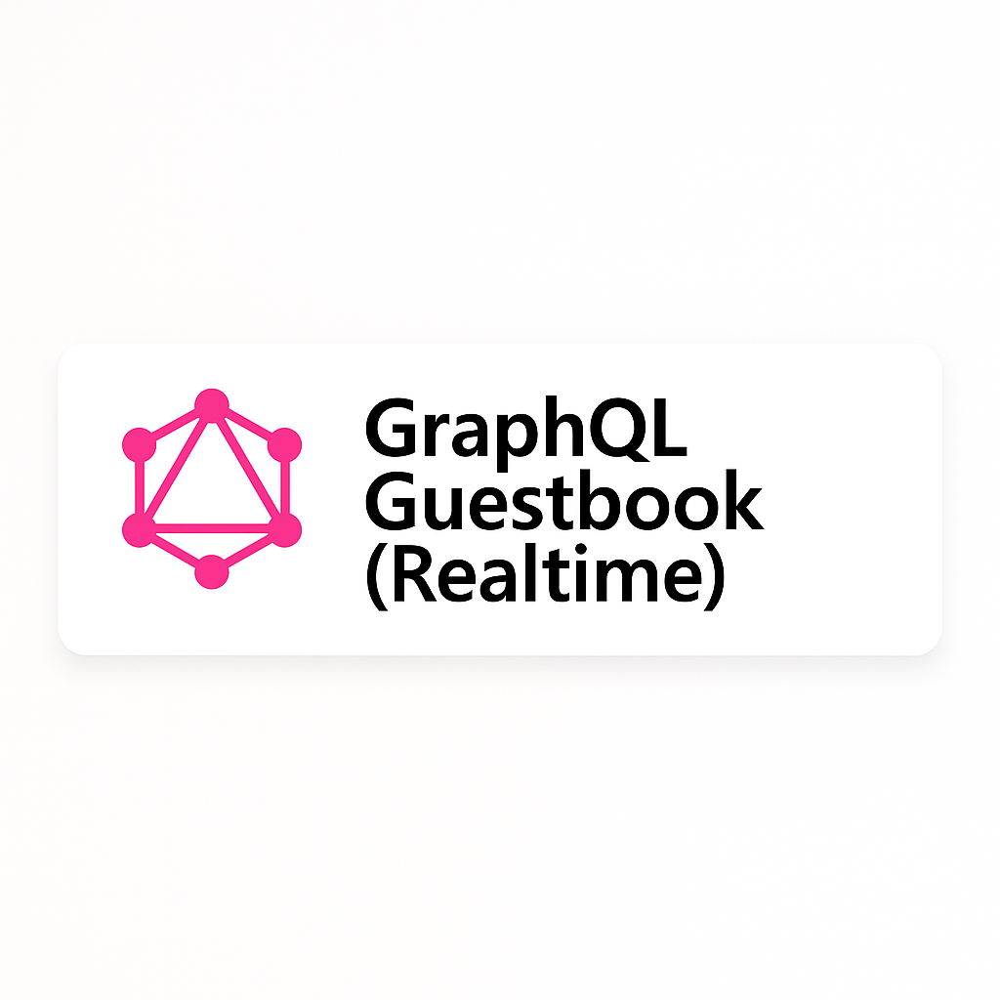

# 🪶 GraphQL Guestbook (Realtime)

**A minimal full-stack GraphQL project** built with  
**Apollo Server / Apollo Client / React / Vite / Tailwind CSS**,  
featuring **Query, Mutation, Subscription (Realtime)** with **optimistic UI** and **HTTP + WebSocket split link**.

> 💬 Send a message and watch it appear in realtime on another tab.

---

## 🖼 Project Banner



---

## 🌐 Demo

[🔗 Live Demo (Vercel)](https://your-vercel-app-url.vercel.app)  
[⚙️ Backend API (Render)](https://your-render-api-url.onrender.com/graphql)

---

## 🧱 Tech Stack

| Layer          | Technology                                       |
| -------------- | ------------------------------------------------ |
| **Frontend**   | React + Vite + Apollo Client                     |
| **UI**         | Tailwind CSS · Responsive · Glassmorphism Design |
| **Backend**    | Apollo Server + Express + GraphQL Subscriptions  |
| **Realtime**   | graphql-ws + WebSocket                           |
| **Language**   | JavaScript (ES Modules)                          |
| **Deployment** | Vercel (frontend) · Render (backend)             |
| **Tools**      | npm · Node.js · GitHub                           |

---

## ⚙️ Run Locally

### 🗄 Backend

```bash
cd backend
npm install
npm run dev
# → http://localhost:4000/graphql
# → ws://localhost:4000/graphql
```

### 💻 Frontend

```bash
cd frontend
npm install
npm run dev
# → http://localhost:5173
```

**Optional `.env`**

```env
VITE_GRAPHQL_HTTP=http://localhost:4000/graphql
VITE_GRAPHQL_WS=ws://localhost:4000/graphql
```

---

## ✨ Features

- ✅ **GraphQL Query:** Fetch latest messages with pagination
- ✅ **GraphQL Mutation:** Add new messages
- ✅ **GraphQL Subscription:** Live updates (websocket)
- ✅ **Optimistic UI:** Instantly show message before server response
- ✅ **Cache Dedupe:** No duplicates thanks to Apollo `typePolicies`
- ✅ **Tailwind Premium UI:** Glass card, bubble chat style, responsive layout
- ✅ **Filter Mode:** Show “All” or “My” messages
- ✅ **Modern Stack:** Apollo split link (HTTP + WS)
- ✅ **Reusable code:** Clean modular structure

---

## 🖼 UI Preview

| Light Mode                                        | Realtime                                |
| ------------------------------------------------- | --------------------------------------- |
|  |  |

> Two browser tabs showing realtime updates ⚡

---

## 🚀 Deploy Guide

### 1️⃣ Backend (Render)

- Create new **Web Service**
- Environment: Node 18+
- Build Command:
  ```bash
  npm install && npm run start
  ```
- Start Command:
  ```bash
  node src/index.js
  ```
- Expose `/graphql`
- Copy your Render URL, e.g.  
  `https://graphql-guestbook-api.onrender.com/graphql`

### 2️⃣ Frontend (Vercel)

- Set Environment Variables:
  ```env
  VITE_GRAPHQL_HTTP=https://graphql-guestbook-api.onrender.com/graphql
  VITE_GRAPHQL_WS=wss://graphql-guestbook-api.onrender.com/graphql
  ```
- Deploy → Done!

---

## 📁 Folder Structure

```txt
graphql-guestbook-realtime/
│
├── backend/
│   ├── src/
│   │   ├── index.js           # Apollo Server + Express + WS
│   │   └── schema/resolvers   # GraphQL schema and resolvers
│   └── package.json
│
├── frontend/
│   ├── src/
│   │   ├── App.jsx            # UI + Apollo Hooks (Query/Mutation/Sub)
│   │   ├── lib/apollo.js      # Apollo Client setup (HTTP/WS split)
│   │   ├── graphql.js         # Queries, Mutations, Subscriptions
│   │   └── index.css          # Tailwind styles
│   └── package.json
│
└── README.md
```

---

## 🧠 Key Learnings

- How to connect Apollo Client with both **HTTP and WebSocket**
- Managing **optimistic updates** and **cache deduplication**
- Implementing **GraphQL Subscriptions** via `graphql-ws`
- Styling modern UIs using **TailwindCSS + responsive layout**
- Deploying a **full-stack GraphQL app** on Render & Vercel

---

## 🧑‍💻 Author

**Your Name**  
💼 Full Stack / Frontend Developer  
📫 your-email@example.com

---

## 🪪 License

MIT
